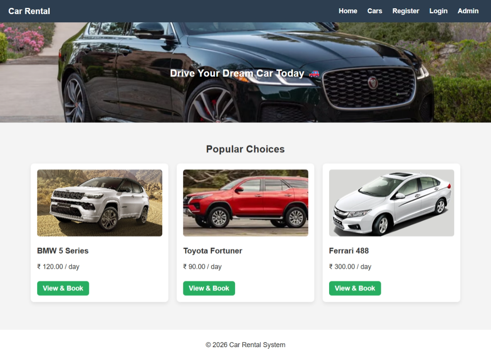
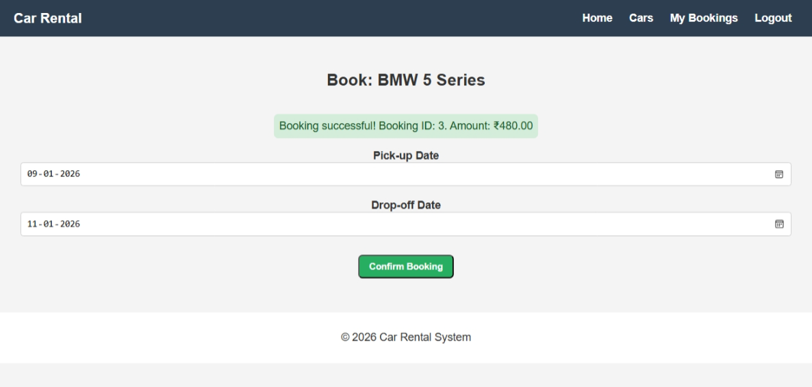
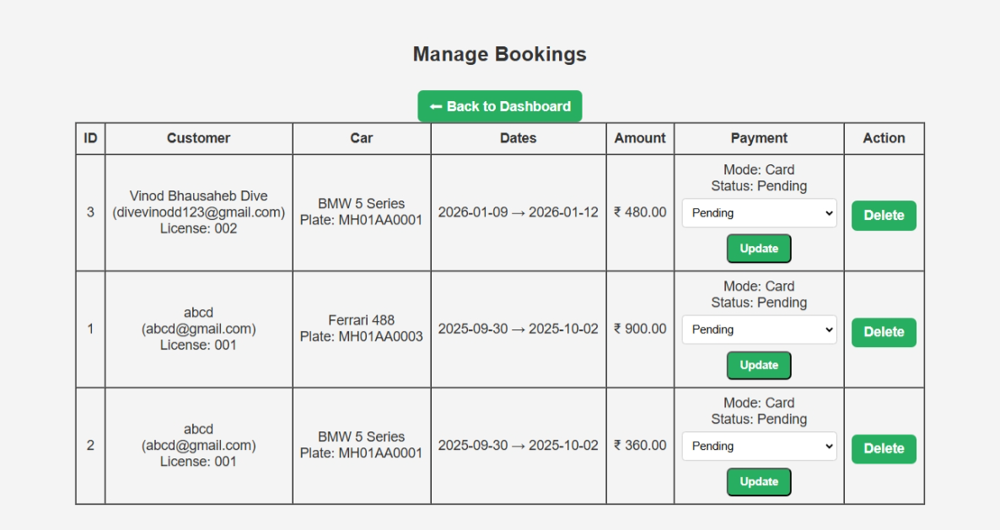

# Car Rental Management System

A full-featured car rental management system built with PHP and MySQL. Users can browse available cars, make bookings, and manage their reservations. Administrators can manage cars and bookings through a dedicated dashboard.



## Features

### User Features
- User registration and login
- Browse available cars
- Book cars for specific dates
- View and manage personal bookings
- Cancel bookings

### Admin Features
- Admin dashboard
- Manage car listings (add, edit, delete cars)
- View and manage all bookings
- Cancel/reserve bookings

## Prerequisites

- XAMPP (or any PHP/MySQL server)
- PHP 7.0 or higher
- MySQL 5.6 or higher
- Web browser

## Installation

### Step 1: Setup Local Server
1. Install [XAMPP](https://www.apachefriends.org/) if not already installed
2. Start Apache and MySQL services in XAMPP Control Panel

### Step 2: Install the Project
1. Download or clone this repository
2. Copy the `car-rentel` folder
3. Paste it inside your XAMPP's htdocs directory:
   - `C:\xampp\htdocs\` (Windows)

### Step 3: Setup Database
1. Open PHPMyAdmin: http://localhost/phpmyadmin
2. Create a new database named `carrental`
3. Import the `db_init.sql` file located in the project root

### Step 4: Run the Application
Open your browser and navigate to: http://localhost/car-rentel

## Login Credentials

### Admin Account
| Field | Value |
|-------|-------|
| Email | admin@carrental.com |
| Password | admin123 |

### User Registration
New users can register through the registration page to create their own accounts.

## Project Screenshots

### Home Page


### Booking Page


### Admin - Manage Bookings


## Project Structure

```
car-rentel/
├── admin/
│   ├── dashboard.php      # Admin dashboard
│   ├── login.php          # Admin login
│   ├── logout.php         # Admin logout
│   ├── manage_cars.php    # Manage car listings
│   └── manage_bookings.php # Manage all bookings
├── assets/
│   ├── images/            # Project images
│   └── style.css          # Main stylesheet
├── inc/
│   ├── db.php             # Database connection
│   ├── header.php         # Header template
│   └── footer.php         # Footer template
├── cars.php               # Browse cars page
├── book.php               # Book a car
├── booking.php            # Booking details
├── index.php              # Home page
├── login.php              # User login
├── logout.php             # User logout
├── my_bookings.php        # User's bookings
├── register.php            # User registration
├── create_admin.php       # Create admin account
├── db_init.sql            # Database initialization
└── README.md              # This file
```

## Technologies Used

- **Frontend**: HTML, CSS, JavaScript
- **Backend**: PHP
- **Database**: MySQL
- **Server**: Apache (XAMPP)

## License

This project is open-source and available for educational purposes.

